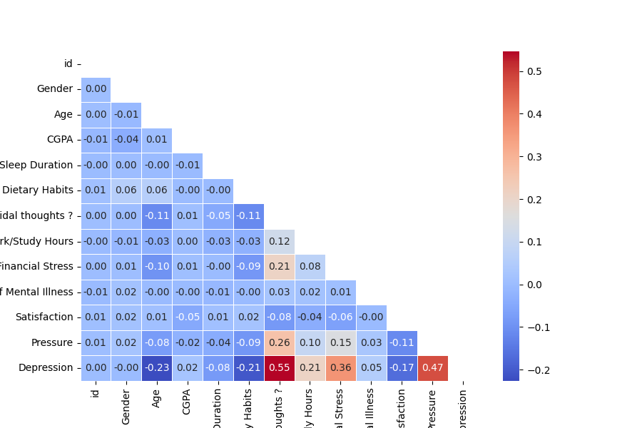

## Student/Worker Segmentation Models with CGPA Feature

This section describes the model segmentation based on student/worker status, incorporating a new feature for students.

**Data Preprocessing:**

The following columns were processed as described:

* **Dropped Columns:**
    * `Name`
    * `Profession`
    * `Degree`
* **Excluded from Model:**
    * `id`
    * `City`

**Model Segmentation:**

Models were segmented by `Working Professional or Student`.

**Observations:**

A new column, `CGPA`, was added specifically for the student segment.

Correlation analysis (see Figure 1) revealed that `CGPA` does not exhibit a strong correlation with depression. This contrasts with the stronger influence of 'satisfaction' and 'pressure' on depression.

**Conclusions:**

The addition of the `CGPA` feature did not improve the student model's performance.  In fact, the training accuracy slightly decreased to 0.85008.  Furthermore, with the same hyperparameters used in the previous student model, the test data accuracy also decreased to 0.94083.

These results reinforce the conclusion that students require additional profile information to improve model accuracy.  Potentially relevant features might include family and relationship dynamics.

