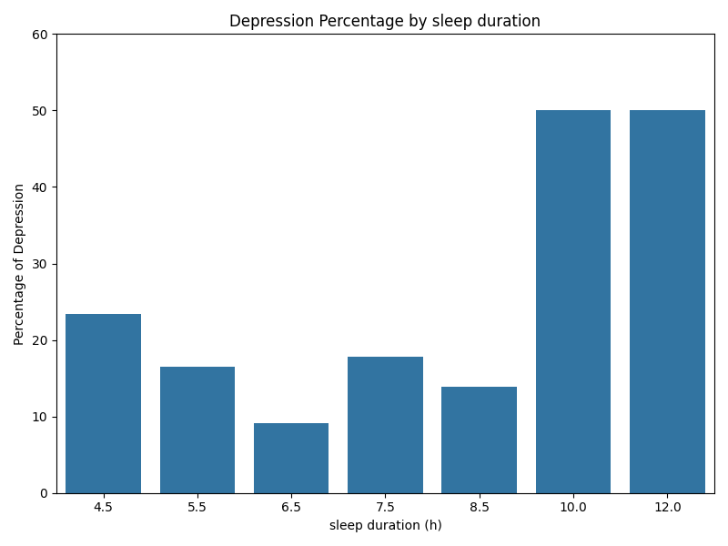
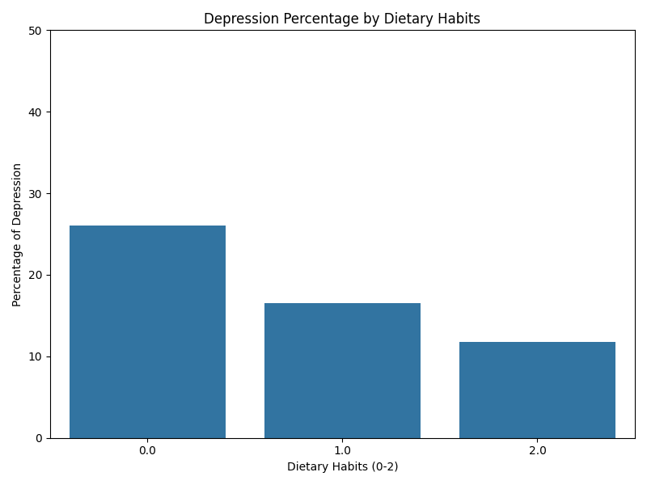
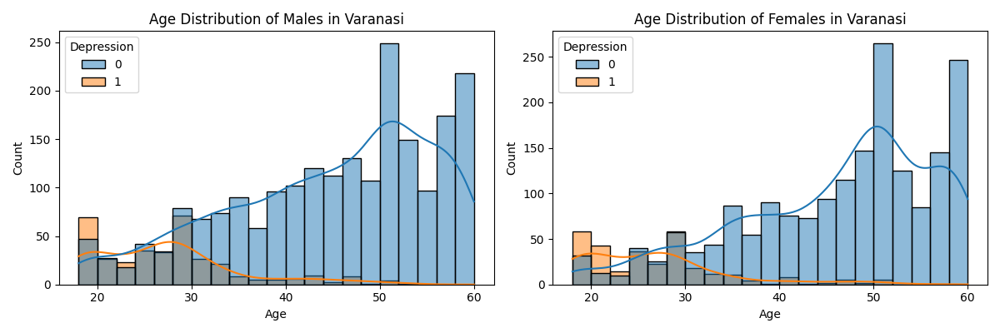
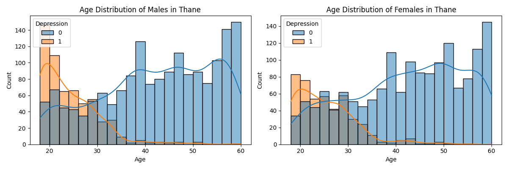
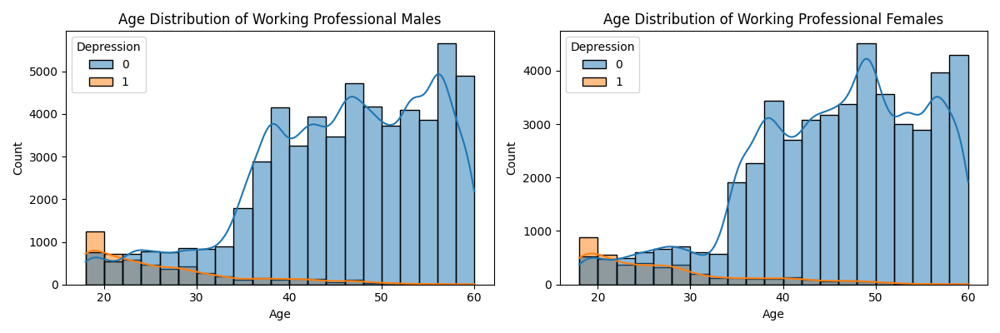
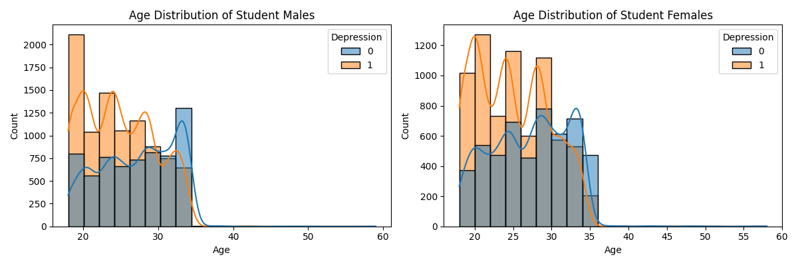
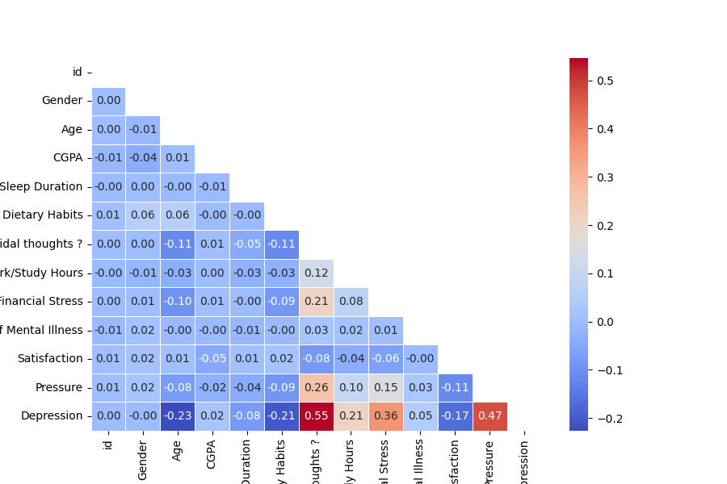
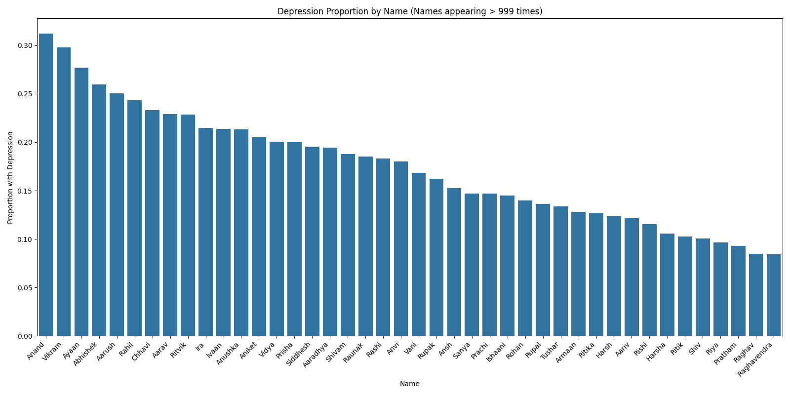

# Mental_Health 
Kaggle Playground Series - Season 4, Episode 11

This repository documents my work on the Kaggle Playground competition for Season 4, Episode 11. 

## Mental Health Prediction Project

This project focused on developing a predictive model for mental health status using the provided `Datasheet/Mental_Health.zip` dataset.  An agile methodology was employed, with iterative improvements made throughout the development process.

The models were trained using scikit-learn:

*   Random Forest Regressor: [scikit-learn](https://scikit-learn.org/stable/index.html)
*   XGBoost (eXtreme Gradient Boosting): [XGBoost](https://xgboost.readthedocs.io/en/stable/index.html)

### Initial Model Development (Mental_Health.V1)

The dataset was initially preprocessed by removing the following columns: 'Name', 'City', 'Working Professional or Student', 'Profession', 'CGPA', 'Sleep Duration', 'Dietary Habits', and 'Degree'. Hyperparameter tuning was performed using `GridSearchCV`.  While increasing the fitting iterations yielded only marginal gains, a significant performance difference was observed between the models:

*   Random Forest: 0.92707
*   XGBoost: 0.93320

### Iterative Improvements (Agile Methodology)

**Version 2: Study of Dropped Columns**

An investigation was conducted to assess the potential impact of the dropped columns on model performance.

*   **'Name', 'Profession', and 'Degree':** These columns were deemed too complex for straightforward model integration.
*   **'CGPA':** Analysis revealed no correlation between 'CGPA' and 'Depression'.
*   **'Sleep Duration':** Consistent with other studies, a correlation was observed between sleep duration and depression. Individuals sleeping between 5.5 and 8.5 hours showed the lowest rates of depression.  Those sleeping less than 5 hours had a depression rate exceeding 20%, while those sleeping more than 9 hours had a depression rate of 50%. This column was considered essential for profiling.

*   **'Dietary Habits':** A clear trend emerged, with individuals reporting "Unhealthy" dietary habits exhibiting higher rates of depression than those with "Healthy" diets. This column was also deemed important for profiling.

*   **'City':** Analysis of age distribution and depression rates across different cities revealed variations, suggesting a relationship between city and depression, potentially influenced by the percentage of students in each city.

*   **'Working Professional or Student':** This column revealed a substantial difference in depression rates, with 50% of students reporting depression compared to only 8% of workers.

*   **Gender:** No significant difference in depression rates was observed between genders.

Based on these findings, the subsequent models were developed with stratified data:

**Version 2: City-Based Modeling [Mental_Health.V2](Mental_Health.V2/)**

Recognizing the influence of location, the data was stratified by 'City,' and separate XGBoost models were trained for each city. Missing values were assigned to a new "Lost city" category, representing only 0.5% of the data. This approach resulted in a test accuracy of 0.93464, a slight improvement.

**Version 2b: Student/Worker Stratification [Mental_Health.V2b](Mental_Health.V2b/)**

The data was stratified by professional status ('Student' and 'Worker'), and separate XGBoost models were trained for each group.

*   Workers: 0.9618347 (Train)
*   Students: 0.84932439 (Train)

The worker model performed well, while the student model showed lower accuracy. Further hyperparameter tuning improved the student model's performance:

*   Workers: 0.9618347 (Train)
*   Students: 0.8516540 (Train)

The overall test score for this version was 0.94109, later reaching 0.94163 with minor adjustments, approaching the competition's top score of 0.94184.

**Version 2.5: Student/Worker Stratification with CGPA [Mental_Health.V2.5](Mental_Health.V2.5/)**

This version explored the inclusion of 'CGPA' for students. However, the correlation between 'CGPA' and 'Depression' was minimal, and the final score was 0.94083, lower than the previous version.

**Version 3: Name Stratification (Mental_Health.V3)**

This version investigated the relationship between 'Name' and 'Depression'.  A relationship was identified, but modeling proved challenging.  Analysis of the training data (140,700 rows and 500 names) revealed that the most frequent name (Rohan, 3178 occurrences) did not correspond to the highest depression rate.  For example, "Anand" with 1486 occurrences had a higher depression rate than "Rohan".  Due to the complexity of modeling this relationship, further development was paused.

### Analysis and Future Directions

The project emphasized the importance of feature engineering and targeted modeling. While stratification by city and professional status yielded improvements, further refinements are necessary.

**Feature Engineering:**  Improving the questionnaire design is crucial. The current questions may not adequately capture the nuances of mental health.  The confusion matrix analysis revealed a higher rate of false negatives for workers and a higher rate of false positives for students.

**Potential Enhancements:**

*   **Expanded Questionnaire:**  Including questions about family dynamics, family size, marital status, and number of children could provide valuable insights.
*   **Targeted Questions:**  Tailoring questions to specific demographics (students vs. workers) may enhance model accuracy.
*   **Deeper Cultural Understanding:**  Further research into the cultural context, particularly in India, could inform feature engineering and model interpretation.

The project demonstrated a structured approach to model development, using an agile methodology and focusing on iterative improvements.  While the final accuracy approached the top score, the analysis suggests that focusing on feature engineering and a deeper understanding of the data could lead to further significant advancements.
