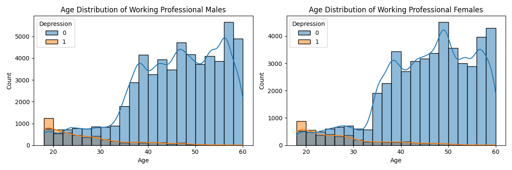
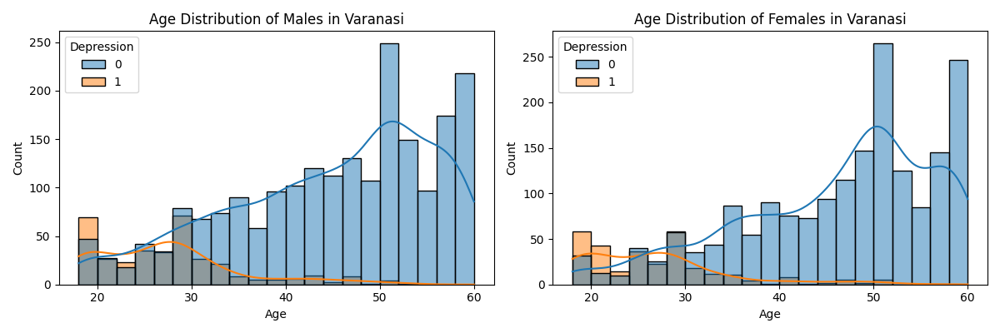
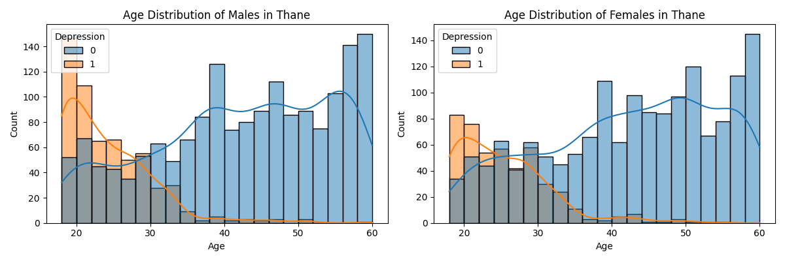
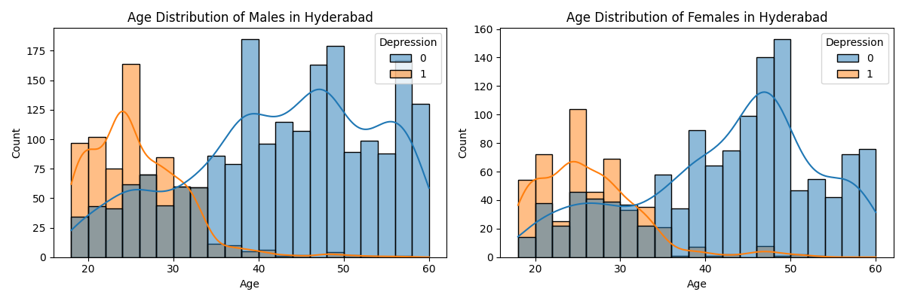

# Initial Analysis and Group Comparison

After the initial submission, I conducted a deeper analysis of the data columns.  A significant portion of the respondents (27,901, nearly 20%) identified as students, while the remainder identified as workers.  This stark difference in population groups prompted me to investigate depression levels within each group.

### Depression by Profession

The following figures illustrate the depression rates for workers and students:

Key observations from these figures:

*   No significant difference in depression levels between males and females was observed.
*   The student group's age range is limited, with a maximum age of 36 years.
*   Over 50% of students reported experiencing depression.
*   Less than 10% of workers reported depression.
*   A general trend of decreasing depression rates with increasing age is apparent.

This analysis reveals a clear difference in depression prevalence between the two populations.

## City-Level Analysis

To further explore variations, I created a DataFrame summarizing the data by city.  The DataFrame, available in `Dara_city.md` or `Datasheet/Dara_city.md`, contains the following columns:

*   `city`: Name of the city.
*   `stu_pop`: Number of respondents in the study from that city.
*   `student %`: Percentage of student respondents in the city.
*   `depressive %`: Percentage of respondents with depression in the city.
*   `dep students %`: Percentage of student respondents with depression in the city.
*   `dep workers %`: Percentage of worker respondents with depression in the city.

This DataFrame revealed variations in depression levels across different cities, leading me to generate city-specific visualizations.

### City-Specific Examples

The following figures showcase three representative cities out of the 30 included in the analysis.  All city-specific figures can be found in the `fig` folder.

These examples highlight the city-level differences in depression rates and age distribution.  The observed variations suggest the potential development of individual models for each city.

## Discussion

While lacking a formal psychology background, my observations align with personal experiences as a former university professor. The significant stress experienced by students concerning their future likely plays a crucial role in the development of depression. This analysis provides valuable insights into the potential impact of depression on a large scale in India, highlighting the need for targeted interventions and support programs.

